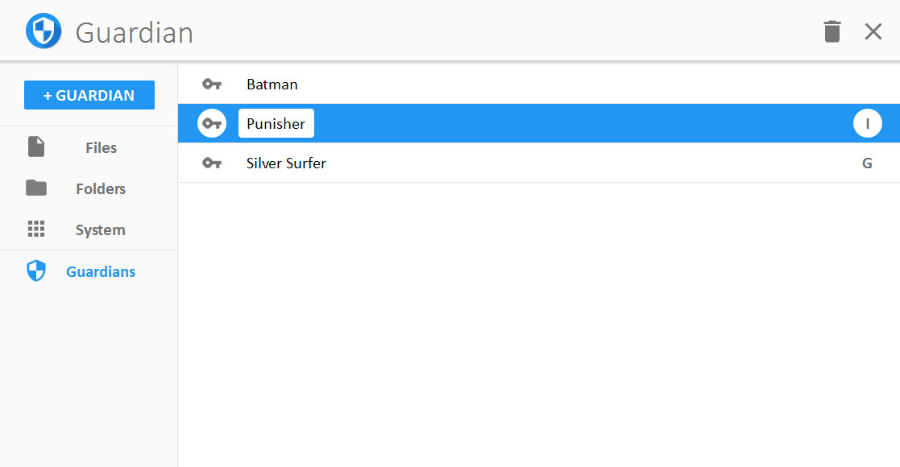

# Guardian #
 *A data protection utility for Windows with USB-key security check.*  
**C++**/**Qt**/**WinAPI**

## Goals:
* access restriction to any file, folder or a system itself
* any USB storage can be used as a key
* multiple USB keys can be used by one user  
  
The project aims to provide basic data protection from unauthorized access. Each protected *item* (a file, a folder or an entire system) is expected to have a *guardian*: a USB flash storage. When a guardian is around (the storage is mounted), an item is opened for interaction. If the storage is unmounted, the access to the item is restricted . The application is expected to let users use any USB storage they want. As USB flash storages are pretty popular these days, it would be nice to have a universal physical key to all of one's secured data.  
## Current state:
*as of 02.06.2015*
  

The project is in a pre-release state.  
  
**What's done**:
* real-time mounted USB devices scan
* add guardian (a key and decrypted message is written to flash stroage, encrypted message is recorded to database)
* guardian authentication mechanism (scanning USB flash for a pass-file, checking this file's contents)
* GUI
* SQLite database storage for lists of files, folders and guardians
* file/folders protection
* file-guardian pairing
* system protection (Windows keeps sending you to a logon screen until you insert the key)
* turn protection on/off (you can disable protection only if the storage is mounted, obviously)
* background mode

**What's to be done**:

* exceptions handling (wrong input/trying to add an already protected file, and etc.). It's pretty hard to break the app even now, but it, for example, has no exclamation windows, so a user wouldn't know if they had done something wrong
  
  
